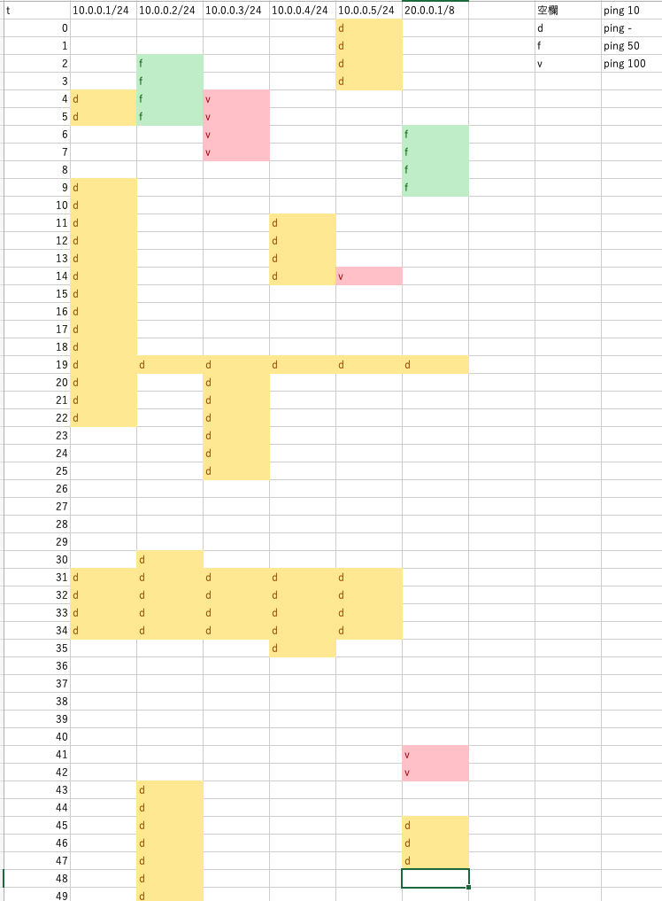

# コーディングテスト

## ファイルの内容

`README.md`: このファイル

`log.xlsx`: 監視ログのテストケース　d,f,v,空欄がそれぞれ -,50,100,10 のpingに対応する。

`log.csv`: `log.xlsx` の CSV

`generate_testcase.py`: `log.csv` から `test_case.txt` を作成する。 `python generate_testcase.py` で実行。

`test_case.txt`: テスト用のログファイル

`problem[n].py`: 設問n のプログラム

監視ログのテストケース



## プログラムの実行方法

numpy, pandas がインストールされた Python 3.8 以上で実行してください。各問題ごとに次のコマンドで実行できます。（n, m, t は問題文に準拠）

```
python problem1.py test_case.txt
python problem2.py test_case.txt n
python problem3.py test_case.txt m t
python problem4.py test_case.txt n
```

## プログラムの出力

各プログラムは一行にホストまたはネットワークアドレス、
故障または高負荷の開始時刻と終了時刻の３つを空白区切りで出力する。
終了時刻は正常な ping が返り始めた時刻とする。

## プログラムの実行結果

### 設問1

```
$ python problem1.py test_case.txt
10.0.0.1/24         2020-10-10 20:30:04 2020-10-10 20:30:06 
10.0.0.1/24         2020-10-10 20:30:09 2020-10-10 20:30:23 
10.0.0.1/24         2020-10-10 20:30:31 2020-10-10 20:30:35 
10.0.0.2/24         2020-10-10 20:30:19 2020-10-10 20:30:20 
10.0.0.2/24         2020-10-10 20:30:30 2020-10-10 20:30:35 
10.0.0.2/24         2020-10-10 20:30:43                     
10.0.0.3/24         2020-10-10 20:30:19 2020-10-10 20:30:26 
10.0.0.3/24         2020-10-10 20:30:31 2020-10-10 20:30:35 
10.0.0.4/24         2020-10-10 20:30:11 2020-10-10 20:30:15 
10.0.0.4/24         2020-10-10 20:30:19 2020-10-10 20:30:20 
10.0.0.4/24         2020-10-10 20:30:31 2020-10-10 20:30:36 
10.0.0.5/24                             2020-10-10 20:30:04 
10.0.0.5/24         2020-10-10 20:30:19 2020-10-10 20:30:20 
10.0.0.5/24         2020-10-10 20:30:31 2020-10-10 20:30:35 
20.0.0.1/8          2020-10-10 20:30:19 2020-10-10 20:30:20 
20.0.0.1/8          2020-10-10 20:30:45 2020-10-10 20:30:48 
```

### 設問2

n = 2 のとき
```
$ python problem2.py test_case.txt 2
10.0.0.1/24         2020-10-10 20:30:05 2020-10-10 20:30:06 
10.0.0.1/24         2020-10-10 20:30:10 2020-10-10 20:30:23 
10.0.0.1/24         2020-10-10 20:30:32 2020-10-10 20:30:35 
10.0.0.2/24         2020-10-10 20:30:31 2020-10-10 20:30:35 
10.0.0.2/24         2020-10-10 20:30:44                     
10.0.0.3/24         2020-10-10 20:30:20 2020-10-10 20:30:26 
10.0.0.3/24         2020-10-10 20:30:32 2020-10-10 20:30:35 
10.0.0.4/24         2020-10-10 20:30:12 2020-10-10 20:30:15 
10.0.0.4/24         2020-10-10 20:30:32 2020-10-10 20:30:36 
10.0.0.5/24         2020-10-10 20:30:02 2020-10-10 20:30:04 
10.0.0.5/24         2020-10-10 20:30:32 2020-10-10 20:30:35 
20.0.0.1/8          2020-10-10 20:30:46 2020-10-10 20:30:48 
```

n = 5 のとき
```
$ python problem2.py test_case.txt 5
10.0.0.1/24         2020-10-10 20:30:13 2020-10-10 20:30:23 
10.0.0.2/24         2020-10-10 20:30:34 2020-10-10 20:30:35 
10.0.0.2/24         2020-10-10 20:30:47                     
10.0.0.3/24         2020-10-10 20:30:23 2020-10-10 20:30:26 
10.0.0.4/24         2020-10-10 20:30:35 2020-10-10 20:30:36 
```

### 設問3

m = 3, t = 40 のとき

```
$ python problem3.py test_case.txt 3 40
10.0.0.2/24         2020-10-10 20:30:02 2020-10-10 20:30:08 
10.0.0.3/24         2020-10-10 20:30:04 2020-10-10 20:30:10 
10.0.0.5/24         2020-10-10 20:30:14 2020-10-10 20:30:17 
20.0.0.1/8          2020-10-10 20:30:06 2020-10-10 20:30:12 
20.0.0.1/8          2020-10-10 20:30:41 2020-10-10 20:30:45 
```

m = 2, t = 80 のとき

```
$ python problem3.py test_case.txt 2 80
10.0.0.3/24         2020-10-10 20:30:05 2020-10-10 20:30:08 
20.0.0.1/8          2020-10-10 20:30:42 2020-10-10 20:30:43 
```

### 設問4

n = 1 のとき
```
$ python problem4.py test_case.txt 1
10.0.0.0/24         2020-10-10 20:30:19 2020-10-10 20:30:20 
10.0.0.0/24         2020-10-10 20:30:31 2020-10-10 20:30:35 
20.0.0.0/8          2020-10-10 20:30:19 2020-10-10 20:30:20 
20.0.0.0/8          2020-10-10 20:30:45 2020-10-10 20:30:48 
```

n = 3 のとき
```
$ python problem4.py test_case.txt 3
10.0.0.0/24         2020-10-10 20:30:33 2020-10-10 20:30:35 
20.0.0.0/8          2020-10-10 20:30:47 2020-10-10 20:30:48 
```

